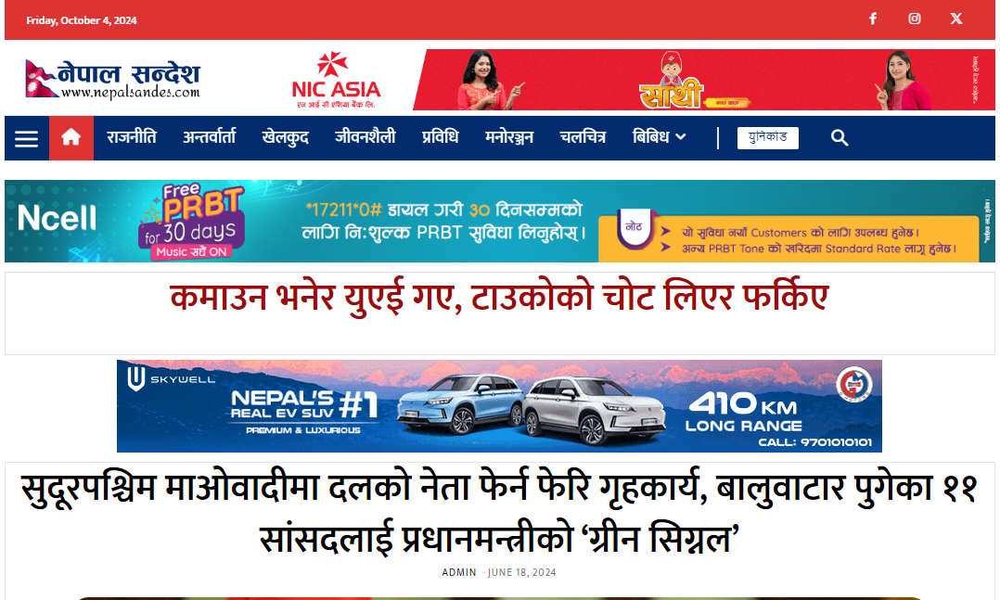

# Nepal Sandes - Nepali News Website

Nepal Sandes is a fully functional Nepali news website developed using WordPress. The website includes key sections such as home, Unicode, stocks, and more, offering a seamless experience for users seeking news and updates in Nepali language.

## Project Overview
- **Project Name:** Nepal Sandes
- **Client:** Bikash Sharma
- **Completion Time:** 25 days
- **Technology:** WordPress, TagDiv Composer, Newspaper theme, Unicode, Custom Code

## Key Features
- **Home Page:** A dynamic homepage displaying the latest news and featured articles.
- **Unicode Support:** Fully supports Nepali Unicode for native language publishing.
- **Stocks Section:** A dedicated section for live stock market updates.
- **Responsive Design:** Ensures the website is fully responsive across devices.
- **SEO Optimized:** The site is optimized for search engines to improve discoverability.

## Preview
Below is a preview of the [nepalsandes.com](https://nepalsandes.com) website:

## License
This project is for the exclusive use of Bikash Sharma and his team. Any redistribution or replication without permission is prohibited.

## Contact
For any queries or support, feel free to contact the developer:
- **Name:** Pradip Subedi
- **Email:** sprasapradip@gmail.com
- **Website:** [pradipsubedi1.com.np](https://pradipsubedi1.com.np)
- **GitHub:** [sprasapradip](https://github.com/sprasapradip)
- **Phone:** +977 9843944252 / +977 9805151362

*For project-related inquiries, or to discuss building a similar website, contact me directly via email or phone.*
